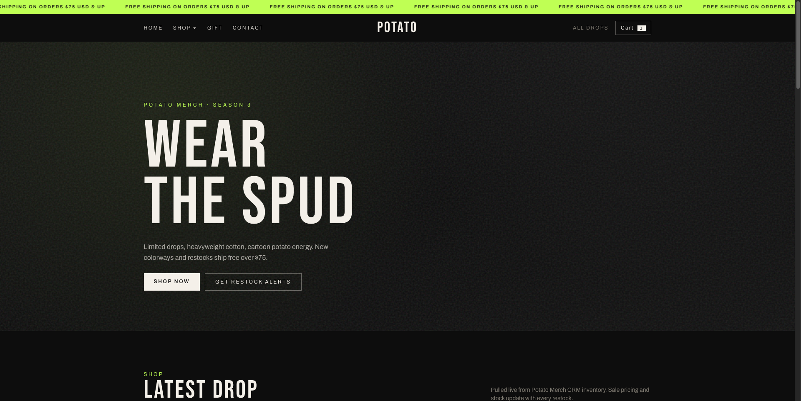
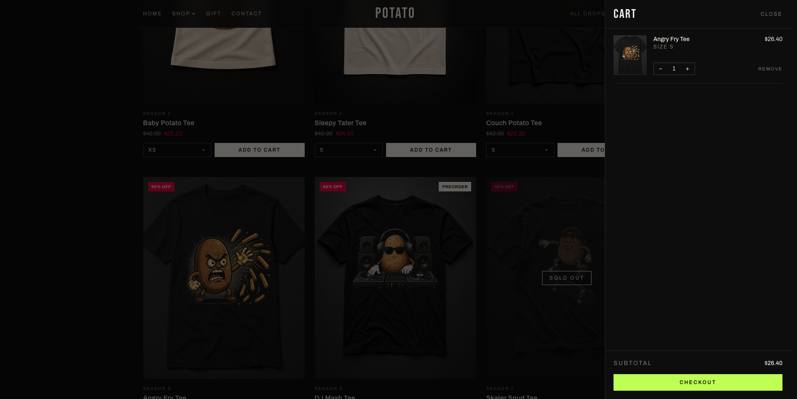
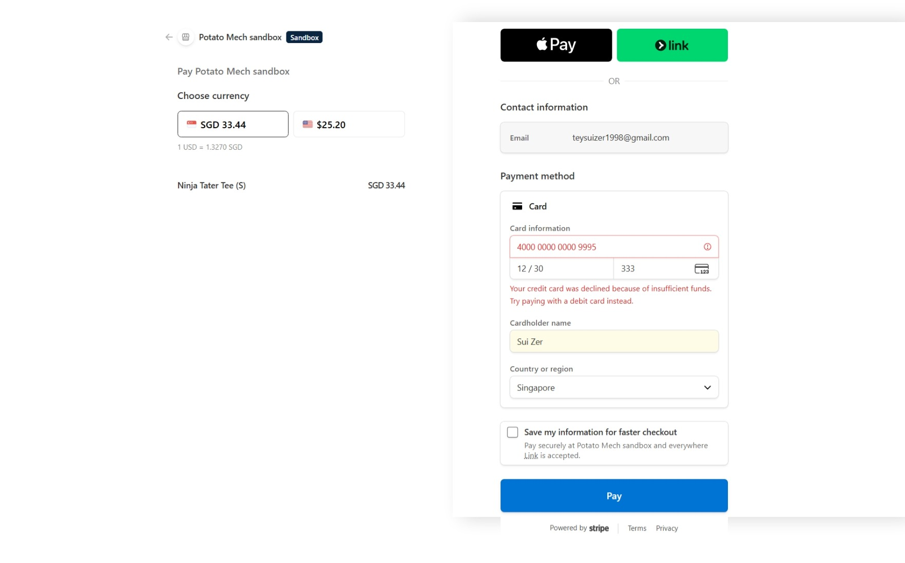

# protobuf-ai-potato

Potato Merch storefront backed by Twenty CRM, Stripe Test Mode checkout, and a Go gRPC chat service (protobuf streaming). Docker Compose runs the shop, CRM, payments webhook forwarder, and chat together.

## What you get

- Store at http://localhost:3001 — catalog, cart, checkout
- Twenty CRM at http://localhost:3000 — products, customers, orders
- Stripe hosted Checkout when `STRIPE_SECRET_KEY` is a `sk_test_...` key
- Potato Pay mock checkout if Stripe keys are empty
- gRPC chat at `:50051` and grpcui at http://localhost:8080







## Quick start

```bash
cp .env.example .env
docker compose up --build
```

Default CRM login: `admin@example.com` / `admin123`

| Service | URL |
| --- | --- |
| Store | http://localhost:3001 |
| CRM (Twenty) | http://localhost:3000 |
| grpcui | http://localhost:8080 |
| gRPC chat | localhost:50051 |

Rebuild only the shop after frontend changes:

```bash
docker compose up -d --build --no-deps --force-recreate store
```

Wipe CRM data and re-seed (destroys Postgres volumes):

```bash
docker compose down -v
docker compose up --build
```

## Store and CRM

The store does not keep its own catalog. It loads Products from Twenty (`/api/products`). Checkout:

1. Creates or updates a Customer in CRM
2. Creates an Order with status PENDING
3. Redirects to Stripe Checkout, or to `/pay` (Potato Pay) if Stripe is not configured
4. A signed webhook marks the order PAID or CANCELLED
5. `/thanks?session_id=...` only reads the session; it does not mark Paid

Newsletter signup also writes a Customer. Tee images live in `store/public/tees/` and Product `imageUrl` values look like `/tees/tee-couch-001.png`.

## Stripe Test Mode (sandbox)

Create a free Stripe account, switch the Dashboard to Test mode, and copy the secret key (not the publishable key) into `.env`:

```env
STRIPE_SECRET_KEY=sk_test_...
STORE_PUBLIC_URL=http://localhost:3001
```

`pk_test_...` is only for Stripe.js / Elements on your own page. This shop redirects to Stripe-hosted Checkout, so the secret key on the server is enough.

Prices on the store and on Stripe Checkout are SGD. Adaptive Pricing is off, so a Malaysia IP does not switch Checkout to MYR.

### Webhooks in Docker

`stripe-listen` in Compose forwards events to `http://store:3001/api/webhooks/payment`. It uses `STRIPE_SECRET_KEY` as `STRIPE_API_KEY`. Stop any host `stripe listen` so events are not delivered twice.

```bash
docker compose up -d stripe-listen
docker compose logs -f stripe-listen
```

Copy `whsec_...` from that log (or print it) into `.env`:

```bash
docker compose exec stripe-listen stripe listen --print-secret
```

```env
STRIPE_WEBHOOK_SECRET=whsec_...
```

That signing secret stays the same across listen restarts for this account. Recreate store after changing `.env`:

```bash
docker compose up -d --force-recreate store stripe-listen
```

Host alternative (no Compose listener):

```bash
stripe login
stripe listen --forward-to localhost:3001/api/webhooks/payment
```

### Test cards

Use these only in Test mode.

| Card | Result |
| --- | --- |
| 4242 4242 4242 4242 | Success |
| 4000 0000 0000 0002 | Generic decline |
| 4000 0000 0000 9995 | Insufficient funds |

Any future expiry, any CVC, any postal code.

After a successful pay you should see `/thanks` with a `cs_test_...` id and the same order as Paid in Twenty.

## Potato Pay (no Stripe)

Leave `STRIPE_SECRET_KEY` empty. Checkout opens `/pay?session_id=cs_mock_...`. Pay / decline / cancel completes a mock session and an HMAC webhook updates CRM. Fine for local demos; not a real charge.

## Chat (gRPC)

Live demo (grpcui): https://protobuf-ai-potato.onrender.com

Set `LLM_PROVIDER` in `.env` to `mock`, `groq`, `gemini`, or `openai`. Groq’s `llama-3.3-70b-versatile` is retired (shutdown 16 Aug 2026); default model is `openai/gpt-oss-120b`. Gemini free-tier default is `gemini-3.5-flash`.

```env
LLM_PROVIDER=groq
GROQ_API_KEY=gsk_...
GROQ_MODEL=openai/gpt-oss-120b
```

```env
LLM_PROVIDER=gemini
GEMINI_API_KEY=AIza...
GEMINI_MODEL=gemini-3.5-flash
```

Chat is one provider at a time. Recreate chat after changing env:

```bash
docker compose up -d --build --force-recreate chat
```

gRPC:

- `Chat(ChatRequest) returns (stream ChatChunk)`
- `ListSessions`
- health + reflection enabled

Local chat without Docker (Go 1.22+, buf): `make run`

## Scaling chat

1. Chat processes are mostly stateless (provider calls + in-memory history).
2. Redis already runs for CRM; session sharing across chat replicas is not wired yet.
3. `docker compose up --build --scale chat=2` scales chat.
4. Put a load balancer in front of `:50051` when you need it.

## Render (grpcui demo)

The public demo uses `Dockerfile.render` so the URL is grpcui (HTTP). gRPC stays inside the container.

1. Render → Web Service → Docker
2. Dockerfile path: `Dockerfile.render`
3. Env: `LLM_PROVIDER`, `GROQ_API_KEY`, `GROQ_MODEL`

Leave `PORT` as Render sets it. Do not point `GRPC_ADDR` at Render’s public port; the entrypoint keeps gRPC on `127.0.0.1:50051`.
